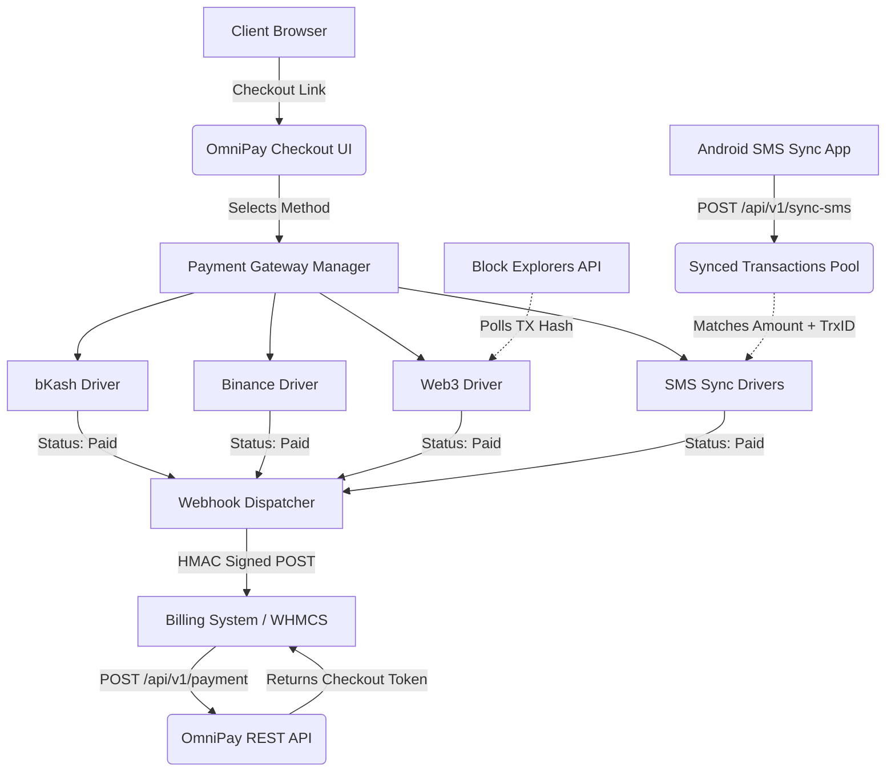

<p align="center">
  
</p>

<h1 align="center">OmniPay</h1>

<p align="center">
  <strong>The Ultimate Self-Hosted Open-Source Payment Gateway Aggregator</strong><br>
  Accept Mobile Financial Services (MFS), Crypto Exchanges, and Web3 payments through a single, unified, extensible platform you fully control.
</p>

<p align="center">
  <a href="#-installation--deployment">
    
  </a>
  <a href="https://github.com/shaikatssj/omnipay">
    
  </a>
</p>

<p align="center">
  <em>Powered by</em><br>
  <a href="https://hostinoz.com" target="_blank">
    
  </a>
</p>

<p align="center">
  <a href="#-quick-start"></a>
  <a href="#-quick-start"></a>
  <a href="#-architecture"></a>
  <a href="#-ios--iphone-support-via-apple-shortcuts-world-first"></a>
  <a href="LICENSE"></a>
</p>

<p align="center">
  <a href="#-the-omnipay-vision">The Vision</a> •
  <a href="#-core-features--gateways">Features</a> •
  <a href="#-system-architecture">Architecture</a> •
  <a href="#-core-components-breakdown">Codebase Breakdown</a> •
  <a href="#-installation--deployment">Installation</a> •
  <a href="#-comprehensive-api-reference">API Docs</a> •
  <a href="#-plugin-development">Development</a>
</p>

---

## 🌍 The OmniPay Vision (Why It's a Game Changer)

Traditional payment gateways lock merchants into rigid ecosystems. They charge exorbitant transaction fees (2% to 5%), dictate terms of service that can result in frozen funds, and limit operations based on geography. 

**OmniPay is not a traditional payment processor. It is a self-hosted orchestration engine.**

OmniPay connects your existing personal accounts (bKash, Nagad, Binance, Metamask) and bridges them into an automated checkout pipeline. By reading confirmation SMS messages from your phone and tracking on-chain blockchain data, OmniPay auto-verifies transactions. 

### The OmniPay Advantage:
* **World-First iOS Support:** The ONLY aggregator platform allowing seamless, background SMS payment forwarding from an iPhone (no jailbreak required).
* **Zero Platform Fees:** Since the payment flows directly to your personal wallets or MFS accounts, there is no intermediary charging a percentage.
* **No Vendor Lock-in:** You deploy the OmniPay server on your own infrastructure (VPS or shared hosting). Your data, invoices, and customer details remain yours.
* **Unified Checkout:** Provide your customers a beautiful, single-page checkout experience that supports local mobile banking and global cryptocurrencies simultaneously.
* **Extensible & Open-Source:** Need a new local payment method? Write a simple PHP class implementing the `PaymentDriverInterface`. 
* **Multi-Tenant System:** Built for scale. A single OmniPay installation can power multiple "Stores," allowing you to act as a payment provider for your other businesses or clients.

---

## ✨ Core Features & Gateways

### 💳 Supported Payment Gateways

OmniPay ships with **10 Production-Ready Drivers** out of the box.

| Gateway / Network | Type | Verification Mechanism | Status |
|---|---|---|---|
| **bKash** | Mobile Financial Service | Tokenized API & Personal (SMS Sync) | ✅ Ready |
| **Nagad** | Mobile Financial Service | Personal (SMS Sync) | ✅ Ready |
| **Rocket** | Mobile Financial Service | Personal (SMS Sync) | ✅ Ready |
| **Upay** | Mobile Financial Service | Personal (SMS Sync) | ✅ Ready |
| **CellFin (IBBL)** | Mobile Financial Service | Personal (SMS Sync) | ✅ Ready |
| **OK Wallet** | Mobile Financial Service | Personal (SMS Sync) | ✅ Ready |
| **Tap** | Mobile Financial Service | Personal (SMS Sync) | ✅ Ready |
| **Binance Pay** | Crypto Exchange | Binance REST API Verification | ✅ Ready |
| **Bybit Pay** | Crypto Exchange | Bybit REST API Verification | ✅ Ready |
| **Web3 (BSC, ETH, TRON, OP, ARB)** | Decentralized Blockchain | Block Explorer API (Etherscan, TronGrid, BscScan) | ✅ Ready |

### 🛠️ Platform Capabilities

* **Intelligent Auto-Verification System:** Employs a unique "fractional offset" algorithm. If an invoice is for $25.00, OmniPay asks for $25.000384 to perfectly match incoming SMS or crypto transactions to the exact invoice, solving the concurrency problem of multiple users paying the same amount at the same time.
* **Multi-Store Architecture:** Merchants can create isolated stores. Each store has its own independent API key, Webhook callback URLs, and payment gateway configurations.
* **Intelligent MFS Parser:** The built-in `MfsParser` service can understand complex SMS structures from 8 different mobile banking providers, extracting TrxIDs, sender numbers, and amounts automatically.
* **Web Installer Wizard:** Zero-CLI setup. Just upload the files, navigate to `/install`, and the wizard handles database connections, migrations, and admin user creation.
* **HMAC-SHA256 Webhooks:** Secure server-to-server callbacks ensure that your frontend/billing system (like WHMCS) only processes legitimate payment confirmations.
* **Sandbox Mode:** Test transactions locally without real money.

## 📸 Screenshots & Platform Overview

### Core Gateways Management
Enable and disable multiple payment gateways globally, such as bKash, Binance, and Web3 wallets, and easily upload custom gateway logos.
.png>)

### Dashboard Overview
View high-level metrics like processed volume, success rate, average ticket size, and revenue charts. Connect your Android SMS Sync App directly via the provided QR code.
.png>)
.png>)

### Storefront Management
Manage multiple merchant stores, view active profiles, and register new API-isolated storefronts with ease.
.png>)

### Invoice Generation
Create custom invoices and direct payment links straight from the admin panel.
.png>)

### Invoice Logs
Track, filter, and manage all invoice transactions including Paid, Pending, Refunded, and Expired statuses.
.png>)

### Customer Checkout Page
A clean, modern payment request page providing customers with all enabled local and global payment options.
.png>)

### API Request Logs
Monitor API traffic and debug requests with detailed logs including endpoint, method, status, duration, and IP address.
.png>)

### Security & Global Settings
Configure critical system controls like Multi-Merchant access, Dynamic Math Captcha, and global SMTP email settings.
.png>)

### Mobile App - SMS Sync Integration
Connect and monitor the Android SMS Sync app to auto-verify mobile financial service transactions silently in the background.
<p align="center">
  
  
</p>

---

## 🏗️ System Architecture

OmniPay is built on the robust **Laravel 12** framework.

### Flow Diagram



---

## 🧩 Core Components Breakdown

OmniPay is highly modular. Understanding the core Models, Services, and Controllers will allow you to confidently modify or extend the engine.

### 🗄️ Models (The Data Layer)

| Model | Description & Responsibilities |
|---|---|
| **`User`** | Represents the platform users. Users can be `admin` (global control) or `merchant` (manages their own stores). Contains attributes for Two-Factor Authentication (`two_factor_secret`), notification preferences, and the critical `sms_sync_key` used by the Android App to map incoming SMS data to a specific merchant. |
| **`Store`** | Represents a merchant's business entity. A `User` can have many `Stores`. Each store generates a unique `api_key` which is used by external billing systems (WHMCS, WooCommerce) to create invoices on behalf of this store. |
| **`PaymentMethod`** | A global dictionary of available payment gateways (e.g., code `bkash`, `binance`, `web3`). |
| **`StorePaymentConfig`** | The pivot model between a `Store` and a `PaymentMethod`. It stores the merchant's specific credentials (e.g., API keys, Wallet Addresses, Personal Phone Numbers) in a JSON `settings` column. |
| **`Invoice`** | The central ledger. Records `amount` (base cost), `expected_amount` (cost + micro-offset for tracing), `status` (pending/paid/expired), and the generated `payment_link`. Uses Eloquent Events to automatically fire Webhooks and send Email Notifications when the status changes to `paid`. |
| **`SyncedTransaction`** | A temporary holding pool. When the Android SMS App reads a payment text message, it pushes the data here via the API. Payment Drivers constantly query this table to find matches for pending Invoices. Once a match is found and applied to an invoice, the record is destroyed to prevent double-spending. |

### ⚙️ Services (The Logic Layer)

| Service | Description & Responsibilities |
|---|---|
| **`PaymentGatewayManager`** | A registry for the plugin system. On boot, all available Payment Drivers (implementing `PaymentDriverInterface`) are registered here. Controllers use this manager to resolve the correct driver dynamically based on the user's selection at checkout. |
| **`MfsParser`** | The brain behind the SMS parsing. Contains complex regex rules mapped by priority for various Mobile Financial Services (bKash, Nagad, Rocket, Upay, CellFin). Extracts `amount`, `trxid`, and `sender` from raw, unstructured text messages. It handles English/Bengali variations and gracefully falls back to generic extraction if strict regexes fail. |
| **`MailNotificationService`** | Handles all outbound SMTP emails using Laravel's Mail facade. Sends beautiful HTML receipts for `InvoiceCreated`, `InvoicePaid`, and `InvoiceExpired` events to the customer, and alerts the merchant if a manual intervention is required. |
| **`TotpService`** | Implements Time-Based One-Time Passwords (RFC 6238) for merchant and admin dashboard security (Google Authenticator compatibility). |
| **`CaptchaService`** | Verifies hCaptcha tokens to protect login, registration, and password reset endpoints from bot abuse. |

### 🎛️ Controllers (The Routing Layer)

| Controller | Description & Responsibilities |
|---|---|
| **`Api\InvoiceController`** | Provides the `POST /api/v1/payment` endpoint. Validates the Store API Key, generates the unique micro-fractional `expected_amount` offset, creates the `Invoice`, and generates the base64-encoded checkout URL token. |
| **`Api\SmsSyncController`** | Provides the `POST /api/v1/sync-sms` endpoint for the Android App. Validates the `sms_sync_key`, calls the `MfsParser` service to decode the SMS, and creates a `SyncedTransaction` record. Prevents replay attacks by ensuring duplicate TrxIDs are rejected. |
| **`CheckoutController`** | Powers the public-facing checkout UI. Handles token decoding (`show`), payment method selection (`selectMethod`), continuous AJAX polling for payment verification (`checkStatus`), and sandbox mode simulations. It dynamically calls the `initiatePayment` and `verifyPayment` methods on the selected Gateway Driver. |
| **`DashboardController`** | The massive backend controller managing the Merchant and Admin portals. Handles CRUD operations for Stores, updating Payment Gateway configurations, viewing/refunding/deleting Invoices, managing QR codes, and viewing API/Activity logs. |
| **`InstallController`** | Powers the web-based setup wizard. Validates PHP extensions, tests MySQL connections, creates the database schema dynamically if missing, runs Laravel migrations/seeds, and writes the `storage/installed` lock file to prevent re-execution. |
| **`Api\AppTransactionController`** | Used by the frontend Merchant Dashboard and mobile merchant apps to list, view, and manually manage (mark paid/cancelled) invoices and synced transactions via REST API. |
| **`Api\GatewayCompatibilityController`** | Provides legacy endpoints (`/api/create-charge`, `/api/verify-payments`) to ensure OmniPay remains backwards compatible with older PipraPay modules used in legacy WHMCS setups. |

---

## 📁 Directory Structure

```text
omnipay/
├── app/
│   ├── Contracts/              # Interfaces (PaymentDriverInterface)
│   ├── Http/
│   │   ├── Controllers/        # Core Application Logic
│   │   │   ├── Api/            # REST API endpoints (Invoice, Sync, Compat)
│   │   │   ├── AuthController  # Login, Register, 2FA
│   │   │   ├── CheckoutController # Public Payment Flow
│   │   │   └── DashboardController # Admin & Merchant Panel
│   │   └── Middleware/         # Request Interceptors (Auth, API Logs, Install Check)
│   ├── Models/                 # Eloquent ORM Models
│   ├── Plugins/                # 💳 Payment Gateway Drivers (bKash, Binance, Web3, etc.)
│   └── Services/               # Shared Logic (MfsParser, Mailer, Totp)
├── config/                     # Application Configuration
├── database/
│   ├── migrations/             # Database Schema Definitions
│   └── seeders/                # Default Data (Gateways, Admin User)
├── public/
│   └── downloads/              # 🔌 Client Integrations (WHMCS, WooCommerce Zips)
├── resources/
│   └── views/                  # Blade Templates
│       ├── auth/               # Authentication Screens
│       ├── checkout/           # Public Payment Gateway UI
│       ├── dashboard/          # Merchant & Admin Panel UI
│       └── install/            # Setup Wizard UI
├── routes/
│   ├── api.php                 # API Route Definitions
│   └── web.php                 # Web & Dashboard Route Definitions
└── storage/                    # Logs, Cache, and 'installed' Lock file
```

---

## 🚀 Installation & Deployment

### Server Requirements

* **PHP:** 8.2 or higher
* **Database:** MySQL 5.7+ or MariaDB 10.3+
* **PHP Extensions:** `openssl`, `pdo`, `mbstring`, `tokenizer`, `xml`, `ctype`, `json`, `bcmath`, `fileinfo`
* **Composer** (If installing via CLI)

### Method 1: Web Installer (cPanel / Shared Hosting)

This is the easiest method and requires no terminal access.

1. **Download:** Grab the latest release archive.
2. **Upload:** Extract the contents into your `public_html` or designated domain folder.
3. **Environment:** Copy `.env.example` to `.env` (ensure `SESSION_DRIVER=file` and `CACHE_STORE=file` are set).
4. **Permissions:** Ensure `storage/` and `bootstrap/cache/` directories are writable (775).
5. **Run Setup:** Navigate to `https://your-domain.com/install` in your browser.
6. The setup wizard will verify requirements, ask for your MySQL credentials, create the database tables, and help you set up the Admin account.

### Method 2: Command Line (VPS / Docker / Local Dev)

```bash
# 1. Clone the repository
git clone https://github.com/your-org/omnipay.git
cd omnipay

# 2. Install dependencies
composer install --optimize-autoloader --no-dev

# 3. Setup environment
cp .env.example .env
php artisan key:generate

# 4. Edit .env with your database credentials
nano .env 

# 5. Run migrations and default seeds
php artisan migrate --force
php artisan db:seed --force

# 6. Optimize for production
php artisan optimize

# 7. Start queue worker (Required for Webhook dispatching and Emails)
php artisan queue:work --daemon
```

---

## 📡 Comprehensive API Reference

OmniPay operates API-first. You can integrate any custom system by utilizing the `/api/v1/` endpoints.

### Authentication

All API endpoints expect the store's unique API Key passed in the header.

```http
X-API-KEY: your_store_api_key_here
Content-Type: application/json
Accept: application/json
```

---

### 1. Create a Payment Invoice

Creates a new checkout session.

**Endpoint:** `POST /api/v1/payment`

**Request Payload:**

| Field | Type | Required | Description |
|---|---|---|---|
| `amount` | `float` | ✅ Yes | The payment amount (e.g., 50.00). Must be > 0. |
| `customer_name` | `string` | ✅ Yes | The full name of the payer. |
| `customer_email` | `string` | ✅ Yes | The email of the payer (receives receipts). |
| `currency` | `string` | No | Base currency (Default: `USDT`). |
| `callback_url` | `string` | No | Webhook URL for server-to-server notifications. |
| `cancel_url` | `string` | No | Browser redirect URL if user cancels or completes. |
| `meta_data` | `object` | No | Any custom JSON data (e.g., `{"order_id": 123}`). |
| `is_sandbox` | `boolean`| No | If true, creates a simulated invoice for testing. |

**Response (`201 Created`):**
```json
{
  "success": true,
  "invoice_id": "INV-X9K2M3ZPLQ",
  "amount": 50.00,
  "expected_amount": 50.000412,
  "currency": "USDT",
  "payment_link": "https://your-domain.com/checkout/BASE64_TOKEN_HERE",
  "expires_at": "2026-06-20 14:30:00"
}
```

---

### 2. Verify Payment Status

Check the current status of an invoice.

**Endpoint:** `GET /api/v1/transactions/{invoice_id}`

**Response (`200 OK`):**
```json
{
  "success": true,
  "invoice": {
    "invoice_id": "INV-X9K2M3ZPLQ",
    "status": "paid",
    "amount": 50.00,
    "paid_at": "2026-06-20 14:15:00",
    "meta_data": {
      "order_id": 123,
      "txHash": "0xabc123..."
    }
  }
}
```

---

### 3. Sync SMS Notification (Mobile App Integration)

This endpoint is utilized by the companion Android Application to push incoming MFS SMS messages to the server pool.

**📱 Android App Download & Setup:**
- **Pre-built APK:** Download the ready-to-use app: [omnipay.apk](omnipay.apk)
- **Source Code:** Download the Android Studio project: [Omnipay_androidstudio_source_code.zip](Omnipay_androidstudio_source_code.zip)

**Setup Instructions:**
1. Install `omnipay.apk` on an Android phone that receives your MFS (bKash/Nagad) SMS notifications.
2. Open the app and grant "SMS Read" permissions.
3. Log in using your OmniPay Merchant email and password, or use your `SMS Sync Key` from the dashboard.
4. The app will run in the background. Whenever a payment SMS arrives, it immediately forwards it to your OmniPay server.

### 🍎 iOS / iPhone Support via Apple Shortcuts (World First!)

> **🏆 Industry First:** Other payment gateway aggregators and licensors *do not* support iPhone SMS reading. OmniPay is proud to be the **FIRST** platform in the world to implement a seamless iOS integration using Apple's native Shortcuts app! **No jailbreak required.**

#### 📋 Prerequisites
* An iPhone running **iOS 14** or later (iOS 17+ recommended for completely silent operation).
* The native Apple **Shortcuts** app installed.
* Your OmniPay `SMS Sync Key` (found in your Dashboard -> Settings -> Security).

#### 🛠️ Step-by-Step Setup Guide

**Step 1: Tell your iPhone to listen for Payment SMS**
1. Open the **Shortcuts** app on your iPhone.
2. Tap the **Automation** tab at the bottom.
3. Tap the **+** (plus) icon at the top right to create a new automation.
4. Scroll down and choose **Message**.
5. In the "Message Contains" box, type your mobile banking name (like `bKash` or `Nagad`).
6. Choose **Run Immediately** so it works automatically in the background.
7. Tap **Next**, then choose **New Blank Automation**.

**Step 2: Tell your iPhone where to send the SMS**
1. Tap **Add Action**, search for the word `URL`, and select it.
2. Type in your website's sync link: `https://your-domain.com/api/v1/sync-sms`
3. Tap the search bar at the bottom again, search for `Get Contents of URL`, and add it.

**Step 3: Add your Secret Key and Details**
1. Tap the little arrow `>` next to "Get Contents of URL" to open its settings.
2. Change the **Method** from `GET` to `POST`.
3. Under **Headers**, add a new header:
   - On the left side (Key), type: `X-API-KEY`
   - On the right side (Text), paste your `SMS Sync Key` (Get this from your OmniPay Dashboard).
4. Under **Request Body**, make sure it says **JSON**, then add two text fields:
   - First field Key: `sender` | Text: `bKash` (or whatever your service is)
   - Second field Key: `msg_data` | Text: Tap this box, and choose **Shortcut Input** from the keyboard menu.

**Step 4: Get a Beautiful Native Notification (Optional but recommended!)**
*Want your iPhone to pop up a success banner when a payment is synced?*
1. Search for **Get Dictionary from Input** and add it. Set it to accept the **Contents of URL** response.
2. Search for **Get Value from Dictionary** and add it. Set the key to `message`.
3. Search for **Show Notification** and add it. Tap the text box and choose the Dictionary Value output. 

**Step 5: Save your Shortcut!**
1. Tap **Done** in the top right corner.
2. **Important:** If you are on iOS 17 or newer, make sure "Notify When Run" is turned **OFF**.

🎉 *That's it! Your iPhone will now silently forward payment messages to your server and pop up a beautiful banner to let you know!*

**Endpoint details (for custom app developers):**
**Endpoint:** `POST /api/v1/sync-sms`

**Request Payload:**
```json
{
  "sender": "bKash",
  "msg_data": "You have received Tk 500.00 from 017XXXXXX. TrxID X8M9KL2 at 14:10."
}
```

---

### Handling Webhooks (Callbacks)

When an invoice transitions to the `paid` status, OmniPay fires a POST request to your `callback_url`.

To prevent spoofing, **you must verify the HMAC signature**. OmniPay signs the entire JSON payload using your Store API Key.

**PHP Webhook Receiver Example:**

```php
<?php

$payload = file_get_contents('php://input');
$signatureHeader = $_SERVER['HTTP_X_OMNIPAY_SIGNATURE'] ?? '';

$myStoreApiKey = 'your_store_api_key_here';
$expectedSignature = hash_hmac('sha256', $payload, $myStoreApiKey);

if (!hash_equals($expectedSignature, $signatureHeader)) {
    http_response_code(403);
    die('Invalid signature');
}

$data = json_decode($payload, true);

if ($data['status'] === 'paid') {
    $orderId = $data['meta_data']['order_id'];
    $paidAmount = $data['amount'];
    
    // Process order fulfillment in your database here...
    
    http_response_code(200);
    echo "Webhook Processed";
}
```

---

## 🔒 Security & Best Practices

Running a payment aggregator requires strict security measures. OmniPay includes several built-in protections:

### 1. Replay Attack Protection
Every payment driver (MFS, Binance, Web3) stores the verified `Transaction ID` (or `TxHash`) inside the invoice's `meta_data` upon successful payment. Before marking an invoice as paid, the system checks if this exact ID has already been used across any other invoice in the database.

### 2. Micro-Offset Matching
Because personal MFS accounts do not have dynamic checkout APIs, multiple users sending `500 BDT` at the same time causes a collision. OmniPay solves this by asking User A for `500.000312 BDT` and User B for `500.000951 BDT`. When the SMS app syncs the transaction, OmniPay matches the exact decimal footprint to the correct invoice.

### 3. API Key Isolation
A Store API Key can only create and read invoices attached to that specific store. If a merchant's store key is compromised, it cannot access data from other stores on the platform. Keys can be instantly regenerated from the Dashboard.

### 4. Two-Factor Authentication (2FA)
We strongly recommend enabling 2FA for all Admin and Merchant accounts via the **Settings -> Security** panel. This utilizes TOTP (Google Authenticator, Authy).

---

## 🛠️ Plugin Development (Creating Custom Gateways)

Adding a new gateway, such as Stripe, PayPal, or a local bank API, takes less than 30 minutes.

### 1. Create the Driver Class

Create a new file `app/Plugins/StripeDriver.php`:

```php
<?php

namespace App\Plugins;

use App\Contracts\PaymentDriverInterface;
use App\Models\Invoice;

class StripeDriver implements PaymentDriverInterface
{
    public function getCode(): string {
        return 'stripe'; // Unique identifier
    }

    public function getName(): string {
        return 'Stripe Credit Card';
    }

    public function initiatePayment(Invoice $invoice, array $settings): array {
        // Return data that will be passed to the frontend Vue/Blade checkout view
        return [
            'public_key' => $settings['public_key'],
            'amount' => $invoice->amount,
            'instructions' => 'Please enter your card details below.'
        ];
    }

    public function verifyPayment(Invoice $invoice, array $settings, array $requestData): array {
        // Validation logic using Stripe SDK
        // ...
        
        if ($paymentSuccessful) {
            $invoice->update(['status' => 'paid', 'paid_at' => now()]);
            return [
                'status' => 'success',
                'message' => 'Card charged successfully!'
            ];
        }
        
        return ['status' => 'error', 'message' => 'Card declined.'];
    }

    public function refund(Invoice $invoice, array $settings, array $refundData): array {
        return ['status' => 'manual', 'message' => 'Please refund via Stripe Dashboard'];
    }
}
```

### 2. Register the Plugin

1. Register your class inside `app/Providers/AppServiceProvider.php` (or a dedicated Gateway provider) so it binds to the `PaymentGatewayManager`.
2. Add an entry to the `payment_methods` database table with the code `stripe`.

Your new gateway will instantly appear in the Admin Dashboard for merchants to configure!

---

## 🙋 Frequently Asked Questions (FAQ)

**Q: Webhooks are not being delivered to WHMCS. Why?**  
**A:** OmniPay uses Laravel's event queue to send webhooks asynchronously. Ensure you are running a queue worker on your server (`php artisan queue:work`) or have configured your server's Supervisor service to keep the queue running.

**Q: The SMS Android App says "Invalid API Key".**  
**A:** Go to your OmniPay Dashboard -> Settings -> Security. You will find your `SMS Sync Key` there. This is different from the `Store API Key`.

**Q: Does it support Auto-Conversion from USD to BDT?**  
**A:** Yes! Every Store Payment Config allows you to set a custom "Conversion Rate". If you pass `USD` to the API, the checkout page will automatically display the equivalent amount in `BDT` to the customer based on your set rate. If you pass `BDT` directly, the conversion rate is ignored (1:1).

**Q: Can I rebrand the frontend for my own company?**  
**A:** Absolutely. OmniPay is MIT Licensed. You can change the logos in `public/`, modify the CSS, and sell access to merchants under your own brand name.

---

## 🤝 Contributing

OmniPay thrives on community contributions. Whether it's adding new blockchain network support, a new local MFS parser regex, or improving the dashboard UI, PRs are deeply appreciated.

1. **Fork** the repository on GitHub.
2. **Clone** your fork locally.
3. **Branch:** Create a new branch (`git checkout -b feature/awesome-new-gateway`).
4. **Commit:** Ensure your code follows Laravel's PSR-12 coding standard (`./vendor/bin/pint`).
5. **Push & Pull Request.**

---

## 📄 License

OmniPay is open-source software licensed under the [MIT License](LICENSE).

This means you are absolutely free to rebrand, resell, modify, and distribute OmniPay in your commercial projects without restriction or attribution requirements.

<p align="center">
  <sub>Engineered for resilience. Built for freedom.</sub>
</p>
